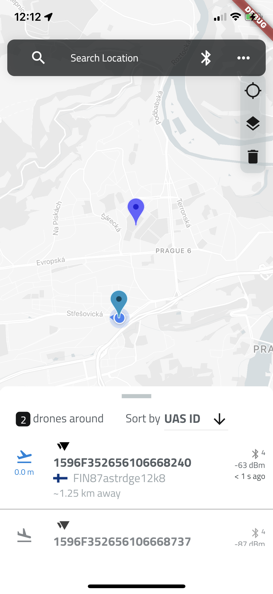
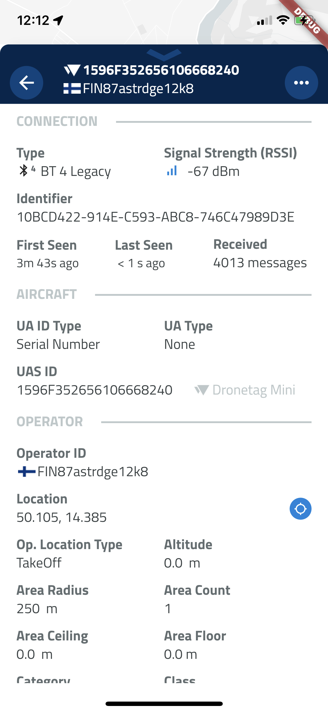

# Drone Scanner

Drone Scanner is an application for scanning surroundings for data broadcasted by Unmanned Aerial Vehicle, such as identification and location. It gathers the data and presents them to user on map.

Drone Scanner can track all the nearby flights over Direct Remote ID standards. Browse real-time data about drones on a detailed map highlighting specific flying space zones. Download Drone Scanner for free and discover what drones fly above your head.

---

> 💡 _This README is a work-in-progress and will be soon updated with all necessary information about the application architecture, ways to build the project, and ways to contribute to this project._

---

## Features

- Discover drones flying nearby in real-time
- Examine detailed information broadcasted by drones via Bluetooth 4, Bluetooth 5, Wi-Fi Beacon, and Wi-Fi NAN
- Browse a detailed map with your location and all nearby aircraft
- Check available data about drones, including real-time height, direction, pilot identification, pilot position, operation description, and location history
- Various flying zones marked and highlighted on the map
- Easy export of collected data
- Continuously updated to reflect the latest EU & US regulations

## Screenshots

## Getting Started

A few resources to get you started if this is your first Flutter project:

- [Lab: Write your first Flutter app](https://flutter.dev/docs/get-started/codelab)
- [Cookbook: Useful Flutter samples](https://flutter.dev/docs/cookbook)

For help getting started with Flutter, view our
[online documentation](https://flutter.dev/docs), which offers tutorials,
samples, guidance on mobile development, and a full API reference.

# Google Maps

The application uses Google Maps API. In order for it to work, you need to obtain your API key. Paste your key to *android/app/src/main/AndroidManifest.xml* and *ios/Runner/AppDelegate.swift*. Create file *google_map_api.json* in *assets/config*, see example file to see the required structure.

The files which contain Google Maps API are added to .gitignore, so your key will not be accidentally commited. If you wish to commit changes in these files, use 'git add -f file'.

---

© 2022, [Dronetag s.r.o.](https://dronetag.cz)
